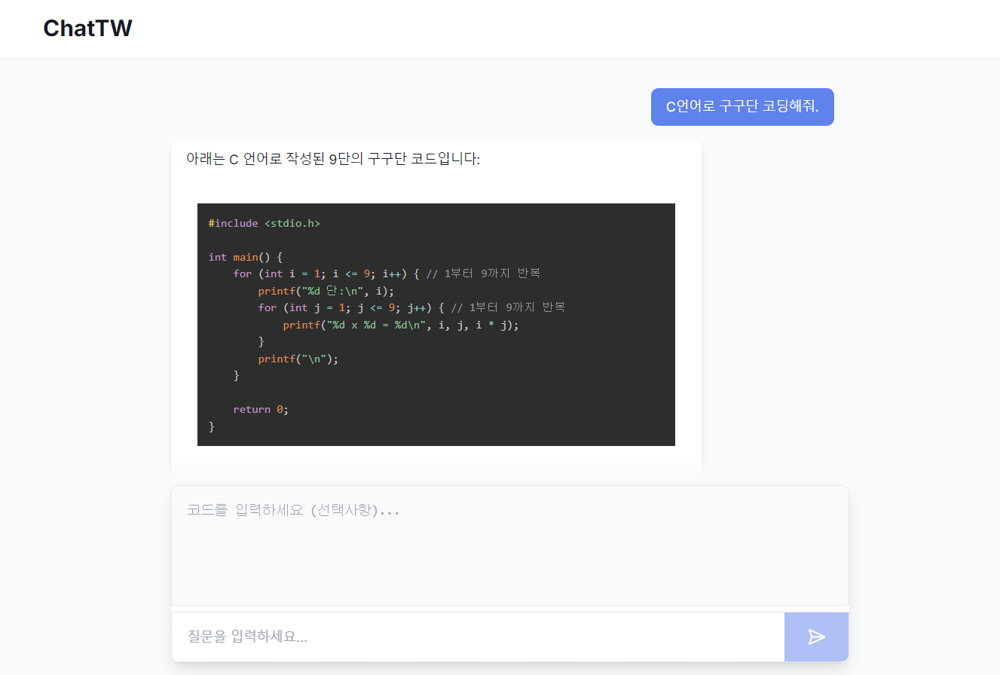

# 🐦 ChatTechWing: In-house Coding Chatbot System for Developers

사내 개발자들이 프로그래밍 작업 중 겪는 문제를 신속하게 해결하고 생산성을 향상시키기 위한 AI 기반 코딩 챗봇을 개발한다. 이 챗봇은 코드 오류 수정, 코드 생성 등 프로그래밍 관련 질문에 대한 답변을 제공하며, 웹 인터페이스를 통해 사용자가 쉽고 직관적으로 접근할 수 있도록 한다. 또한 사내 인트라넷을 통해서만 접속하여 사용할 수 있어 보안성을 높였다.
## 📰 News
- [2024.12.01] 🎨웹 UI/UX 개선
- [2024.11.29] 🐞웹 기능 추가 및 버그 수정
- [2024.11.28] 🎨웹 UI/UX 개선 & Logo 디자인
- [2024.11.26] ✅웹 인터페이스 완료 & v1.0.0 - 기본 기능 구현 완료
- [2024.11.25] 🔥웹 인터페이스 test 전까지 완료
- [2024.11.24] ✅AI 모델 서빙 & API 완료
- [2024.11.23] 🔥프로젝트 시작

# 🎉 Latest Demo

- Model: Qwen2.5-Coder-3B-Instruct-GGUF (For Test!!)
- 코드 생성

- 코드 수정

# ⚡️ New Features/Updates
- ✅ Web Part: Code Highlighting & UI/UX Upgrade Complete
- ✅ AI Part: Basic Function & API Complete
- ✅ Web Part: Basic Web Interface Complete

# 📋 Specification
- Model: [Qwen2.5-Coder-32B-Instruct-GGUF](https://github.com/QwenLM/Qwen2.5-Coder)
- Model Serving: [Ollama](https://ollama.com/)
- API Framework: [FastAPI](https://fastapi.tiangolo.com/)
- Web Framework: [Next.js](https://nextjs.org/)

# 😎 Contributors
